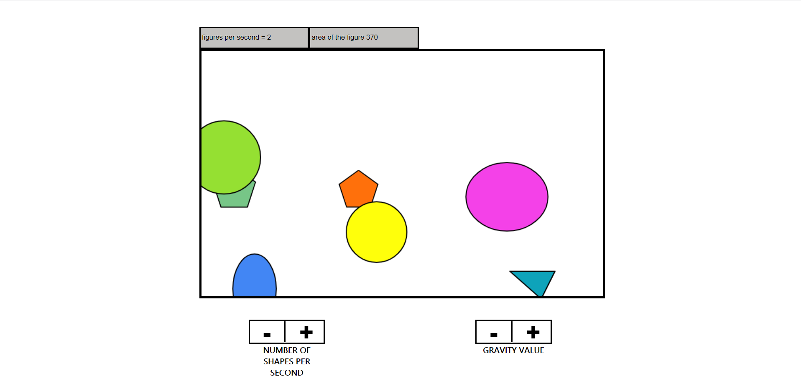

# SimpleGame (Haxe + OpenFl)

## Built With:

[Haxe](https://haxe.org/);
[OpenFl](https://www.openfl.org/);

## Getting Started

---

To get a local copy up and running follow these simple example step:

- at the root of the project, run the command _openfl test html 5_
- or you can run the file index.html that is on the path _Export/html5/bin/index.html_

## Development setup

---

OS Windows:
If you have npm then read the information below:

- [downolad Haxe](https://haxe.org/)
- npm install haxe;
- haxelib install lime;
- haxelib run lime setup;
- lime install openfl;
- lime setup windows;
